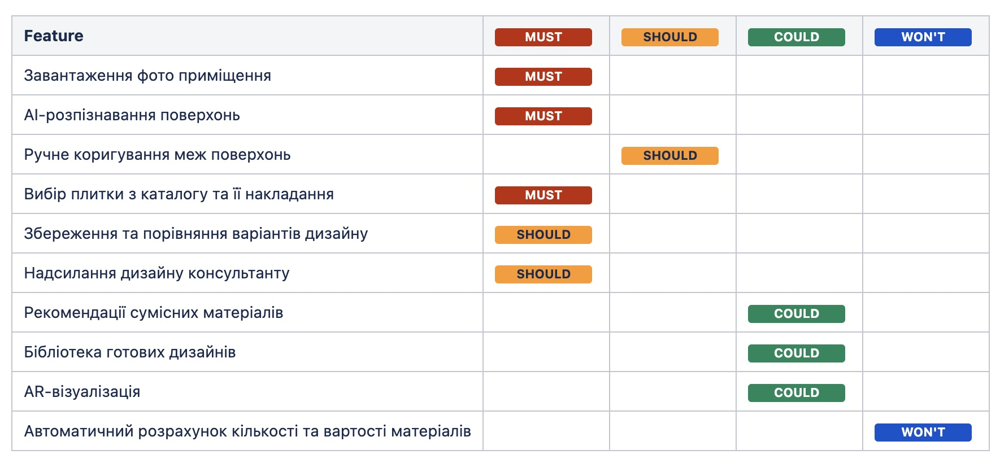

# Feature Prioritization

**Created by:** Mismar
**Last Updated:** June 17, 2026

## Description

This document presents the feature prioritization for **TileVision** using two complementary techniques: **MoSCoW** and **Weighted Scoring**.

The objective is to identify which features are essential for the MVP, which should be implemented in subsequent releases, and which can be postponed based on business value, development effort, and product strategy.

---

# 1. MoSCoW Prioritization

## Legend

| Category | Description |
|----------|-------------|
| **MUST** | Critical features that are essential for the product to function. Without them, the MVP cannot deliver its core value. |
| **SHOULD** | Important features that significantly improve the product but are not mandatory for the initial release. They can be implemented shortly after the MVP. |
| **COULD** | Desirable features that enhance the user experience but have a lower business priority. They are implemented only if time and resources allow. |
| **WON'T** | Features intentionally excluded from the current release and postponed to future product iterations. |

### MoSCoW Matrix

> *Replace `Feature.jpeg` with the uploaded screenshot.*

---

# 2. Weighted Scoring Prioritization

### Formula

**Priority = (Importance × 0.7) + (Complexity × 0.3)**

| Feature | Importance | Complexity | Priority Score |
|---------|-----------:|-----------:|---------------:|
| Room Photo Upload | 5 | 2 | **4.1** |
| AI Surface Detection | 5 | 5 | **5.0** |
| Manual Boundary Correction | 5 | 3 | **4.4** |
| Tile Selection & Visualization | 5 | 5 | **5.0** |
| Save & Compare Designs | 4 | 2 | **3.4** |
| Share Design with Consultant | 4 | 2 | **3.4** |
| Compatible Material Recommendations | 4 | 4 | **4.0** |
| Design Inspiration Library | 3 | 4 | **3.3** |
| AR Visualization | 2 | 5 | **2.9** |
| Automatic Material Quantity & Cost Calculation | 2 | 4 | **2.6** |

---

# Conclusion

The results of both the **MoSCoW** and **Weighted Scoring** prioritization methods are largely consistent with the previously defined **MVP** and **Product Roadmap** for TileVision.

Both approaches identified the core product capabilities—**room photo upload**, **AI surface detection**, **manual boundary correction**, and **tile visualization**—as the highest priorities. These features form the foundation of the primary user journey and deliver the product's main value proposition.

Additional functionality such as **AR visualization** and **automatic material quantity and cost estimation** received lower priority scores. Although these features provide significant value to users, they are not essential for validating the core concept and are therefore planned for later product releases.

Overall, applying both prioritization techniques confirms the initial product strategy. **MoSCoW** clearly identifies which features are required for the MVP, while **Weighted Scoring** provides a quantitative comparison of all planned functionality. Together, these methods support well-informed product planning and a structured development roadmap.

