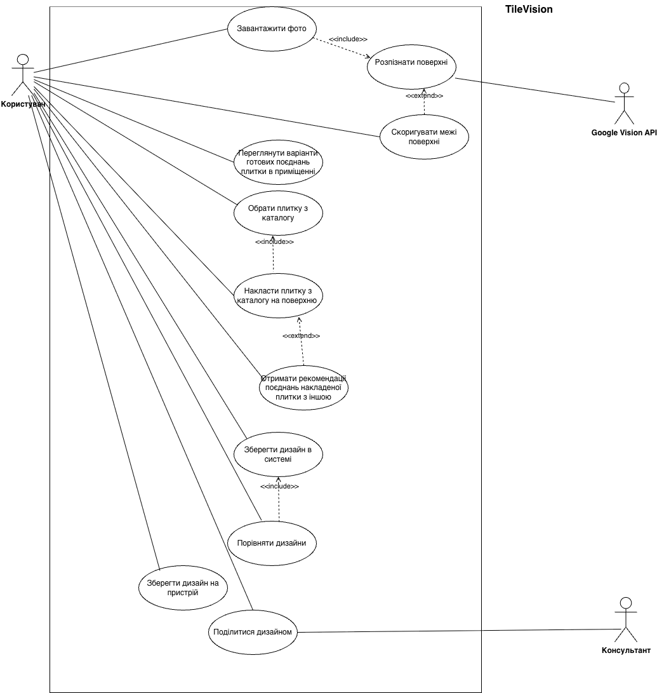
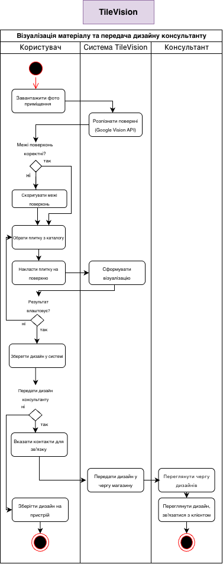
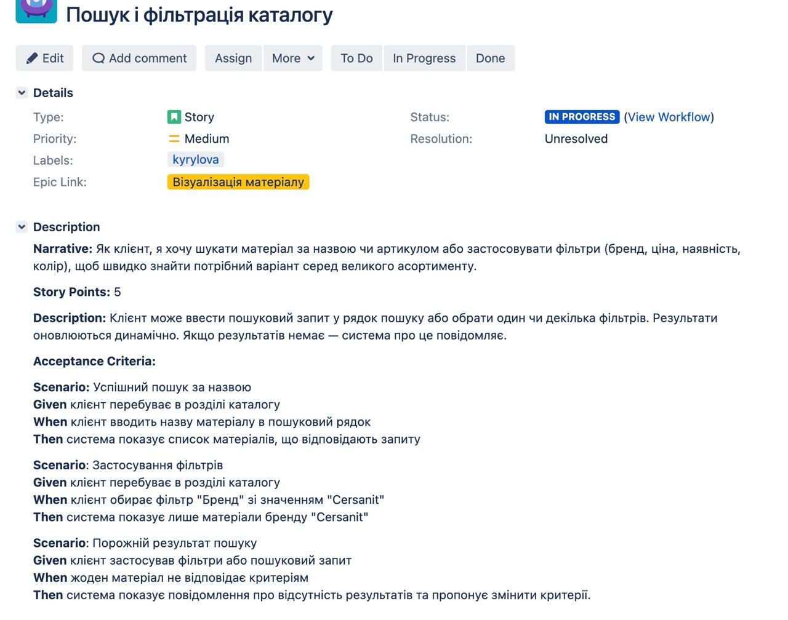
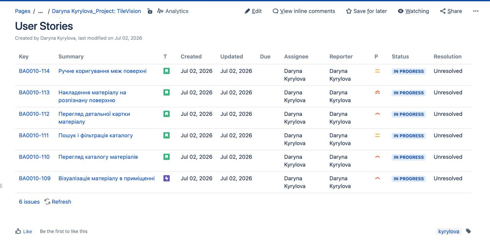
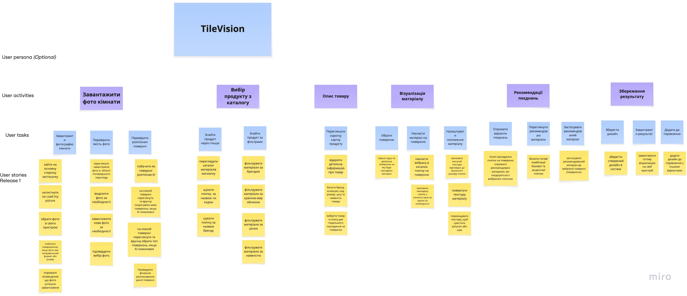

# TileVision — Business Analysis Portfolio

> **Domain:** Tile & Flooring Retail / Interior Design  
> **Role:** Business Analyst  
> **Artifact types:** Use Case Diagram, Activity Diagram (UML), UI Mockups
> Prototype: [View in Moqups](https://app.moqups.com/Mm2ciYCMIVfEs4o4UkQXsLj6A0JlogsN/view/page/a0b35d304)

---

## 1. Project Overview

**TileVision** is a web application for tile and flooring retail stores that helps customers visualise finishing materials in their own space before purchasing. A customer uploads a photo of a room, selects tiles or laminate flooring from the specific store's catalogue, and the AI/algorithm detects surfaces in the photo — floor, walls, backsplash, or shower zone — and overlays the selected material with perspective and scale correction applied.

The application also suggests ready-made designer material combinations (e.g. a base tile paired with an accent or premium collection), helping the customer decide faster, reducing reliance on a design consultant, and giving the store a tool to increase conversion and average order value through relevant recommendations. The system can recommend alternative material combinations based on style, budget, stock availability, and design rules.

### Problem Statement

On the Ukrainian market, 3D visualisation of tiling is typically performed by a store consultant or designer using floor plans and room measurements — a service that requires the customer to visit the store, wait for a consultant, and receive a result only after a separate session. TileVision replaces this bottleneck with a self-service tool: the customer uploads their own photo, tries on tiles from the catalogue independently, compares options, and only then contacts a consultant — arriving better prepared and more confident.

### Product Statement

| Component | Description                                                                                                                                                                   |
|-----------|-------------------------------------------------------------------------------------------------------------------------------------------------------------------------------|
| **For** | Tile and flooring retail stores and their customers                                                                                                                           |
| **Who** | Want to help customers choose materials more confidently before purchasing                                                                                                    |
| **Is a** | Web application for visualising finishing materials                                                                                                                           |
| **That** | Allows customers to upload a room photo, overlay tiles or laminate from the store catalogue, compare options, and forward a chosen design to a consultant                     |
| **Unlike** | Existing 3D visualisation services on the Ukrainian market, which are typically performed by a consultant or store designer based on floor plans and measurements             |
| **Our product** | Combines self-service visualisation for the customer without consultant support — helping customers make a decision faster and helping the store increase purchase conversion |

### Business Goals (SMART)

#### BG-1. Increase conversion from product browsing to consultation request or purchase

| Element | Description |
|---------|-------------|
| **SMART goal** | Within 6 months of TileVision launch, increase the conversion rate of users who browse tiles or laminate on the store website into a consultation request or cart addition by at least **15%** compared to the current baseline. |
| **S — Specific** | Goal targets the conversion rate of store website visitors after using TileVision. |
| **M — Measurable** | Result measured in percentage points: conversion must grow by a minimum of 15%. |
| **A — Achievable** | Achievable because the service helps customers better visualise materials in their own space and reduces pre-purchase hesitation. |
| **R — Relevant** | Aligns with the store's business strategy, as increased conversion directly impacts sales. |
| **T — Time-bound** | Deadline: 6 months after TileVision launch. |

#### BG-2. Shorten the customer's decision-making time

| Element | Description |
|---------|-------------|
| **SMART goal** | Within 4 months of MVP launch, reduce the average time to select a tile or flooring combination from **3 days to 1 day** for users who created at least one design project in TileVision. |
| **Specific** | Goal targets the time a customer spends selecting tiles or laminate. |
| **Measurable** | Result measured by time: average selection period must drop from 3 days to 1 day. |
| **Achievable** | Realistic, because the user can quickly compare several design options in one application without waiting for manual visualisation. |
| **Relevant** | Important for business, as faster decision-making reduces the risk of customer drop-off. |
| **Time-bound** | Deadline: 4 months after MVP launch. |

#### BG-3. Increase average order value through relevant design recommendations

| Element | Description |
|---------|-------------|
| **SMART goal** | Within 6 months of launching the recommendations feature, increase the average order value of purchases made after using TileVision by **10%** through suggestions for accent tiles, premium collections, or complementary materials. |
| **Specific** | Goal targets average order value growth via recommendations for additional or premium materials. |
| **Measurable** | Result measured in percentage points: average order value must grow by 10%. |
| **Achievable** | Achievable because the system can suggest ready-made material combinations, e.g. base tile paired with an accent or premium collection. |
| **Relevant** | Aligns with store business interests, as increasing average order value raises revenue without requiring more customers. |
| **Time-bound** | Deadline: 6 months after launch of the recommendations feature. |

#### BG-4. Reduce designer person-hours spent on baseline visualisations

| Element | Description |
|---------|-------------|
| **SMART goal** | Within 6 months of TileVision launch, reduce the number of designer person-hours spent preparing baseline design visualisations by **30%** through automation of initial material rendering and migration of typical customer requests to a self-service format. |
| **Specific** | Goal targets the reduction of designer person-hours spent on preparing baseline design visualisations for store customers. |
| **Measurable** | Result measured in person-hours and percentage: designer hours on baseline visualisations must decrease by 30%. |
| **Achievable** | Achievable because TileVision automates initial material visualisation and enables customers to independently create baseline design variants. |
| **Relevant** | Aligns with store operational needs by reducing costs on routine design requests and allowing the designer to focus on complex, higher-value client projects. |
| **Time-bound** | Deadline: 6 months after TileVision launch. |

---

## 2. Stakeholders

| Stakeholder | Role | Interest |
|-------------|------|----------|
| **Customer (User)** | Primary actor | Independently visualise and compare tile/laminate options before purchasing |
| **Store Consultant** | Secondary actor | Review customer-submitted designs and initiate contact to close the sale |
| **Tile & Flooring Store** | Business owner | Increase conversion, raise average order value, reduce time spent on pre-sale consultations |
| **AI / Computer Vision System** | Internal system | Automated surface detection, perspective correction, and material overlay rendering |

---

## 3. Functional Requirements

### 3.1 Use Cases

#### Actor: User

| ID | Use Case | Description |
|----|----------|-------------|
| UC-01 | Upload room photo | User uploads a photo of the room or surface to be tiled |
| UC-02 | Recognise surface *(«include»)* | AI/computer vision automatically identifies surface boundaries (floor, walls, backsplash, shower zone) with perspective correction |
| UC-03 | Correct surface borders | User manually adjusts the auto-detected surface boundaries when accuracy is insufficient |
| UC-04 | Browse ready tile combinations | User views curated, pre-made tile arrangement suggestions for inspiration |
| UC-05 | Choose tile or laminate from catalogue | User browses and selects tiles or laminate flooring from the store-specific product catalogue |
| UC-06 | Overlay material on surface | System renders the chosen material onto the detected surface area with perspective and scale correction |
| UC-07 | Get material combination recommendations *(«extend»)* | System suggests complementary material pairings (e.g. base + accent tile) based on style, budget, stock availability, and design rules |
| UC-08 | Save design | User saves the current visualisation to their account in the system |
| UC-09 | Compare designs | User places two or more saved designs side-by-side for comparison |
| UC-10 | Save design to device | User downloads the rendered image to their local device |
| UC-11 | Share design | User shares the design with a consultant or external contact |

#### Actor: Consultant

| ID | Use Case | Description |
|----|----------|-------------|
| UC-12 | Review design queue | Consultant views all designs forwarded by customers |
| UC-13 | Contact customer | Consultant reviews a specific design and initiates contact with the customer |

### 3.2 Functional Requirements

#### FR-1. Upload Room Photo

| ID | Requirement |
|----|-------------|
| FR-1.1 | The system shall allow users to upload a room photo. |
| FR-1.2 | The system shall display the uploaded photo and notify the user if the file format is unsupported or exceeds the maximum file size. |

#### FR-2. Surface Detection

| ID | Requirement |
|----|-------------|
| FR-2.1 | The system shall automatically detect walls, floors, backsplashes, and shower areas in the uploaded photo. |
| FR-2.2 | The system shall display the detected surfaces for user review. |
| FR-2.3 | The system shall allow users to manually adjust detected surface boundaries. |

#### FR-3. Product Catalog

| ID | Requirement |
|----|-------------|
| FR-3.1 | The system shall display the store's product catalog. |
| FR-3.2 | The system shall allow users to search products by name or product code. |
| FR-3.3 | The system shall allow users to filter products by brand, price, and availability. |
| FR-3.4 | The system shall display basic product information in the catalog. |
| FR-3.5 | The system shall retrieve product data from the store's inventory or product management system. |

#### FR-4. Material Visualization

| ID | Requirement |
|----|-------------|
| FR-4.1 | The system shall apply the selected material to the chosen surface. |
| FR-4.2 | The system shall allow different materials to be applied to different surfaces. |
| FR-4.3 | The system shall allow users to replace the applied material without uploading a new photo. |
| FR-4.4 | The system shall allow users to adjust the texture scale. |
| FR-4.5 | The system shall allow users to rotate the material texture. |
| FR-4.6 | The system shall allow users to reposition the material texture to align patterns or joints. |

#### FR-5. Design Recommendations

| ID | Requirement |
|----|-------------|
| FR-5.1 | The system shall display recommended materials that match the selected product. |
| FR-5.2 | The system shall display complete design combinations. |
| FR-5.3 | The system shall allow users to apply a recommended material. |
| FR-5.4 | The system shall recommend only products available in the connected store catalog. |

#### FR-6. Product Details

| ID | Requirement |
|----|-------------|
| FR-6.1 | The system shall display detailed product information. |
| FR-6.2 | Product information shall include brand, collection, product code, size, price, and availability. |

#### FR-7. Design Management

| ID | Requirement |
|----|-------------|
| FR-7.1 | The system shall allow users to save their design. |
| FR-7.2 | The system shall allow users to download the final visualization. |
| FR-7.3 | The system shall allow users to add designs to comparison. |
| FR-7.4 | The system shall allow users to compare multiple saved designs. |

#### FR-8. Consultant Support

| ID | Requirement |
|----|-------------|
| FR-8.1 | The system shall allow consultants to view the customer's saved design. |
| FR-8.2 | The system shall display all products used in the selected design. |
| FR-8.3 | The system shall display the availability of selected products. |
| FR-8.4 | The system shall display detailed product information for consultants. |

---

## 4. Use Case Diagram



**Key relationships:**

- `UC-01 → UC-02` — **«include»**: uploading a photo always triggers automatic surface recognition by the AI/computer vision module.
- `UC-02 → UC-03` — **«extend»**: if recognised borders are inaccurate, the user extends the flow by manually correcting them.
- `UC-05 → UC-06` — **«include»**: choosing a material automatically triggers the overlay visualisation with perspective correction.
- `UC-06 → UC-07` — **«extend»**: the system optionally extends the overlay step by surfacing curated material combination recommendations.
- `UC-08 → UC-09` — **«include»**: saving a design enables the compare-designs feature.

---

## 5. Activity Diagram — Core User Flow

**Swim lanes:** User | TileVision System | Consultant



### Flow Description

```
START
  │
  ▼
[User] Upload room photo
  │
  ▼
[System] Call Google Vision API → Recognise surfaces
  │
  ▼
[User] Decision: Are surface borders correct?
  ├─ YES → proceed
  └─ NO  → [User] Manually correct borders → loop back to check
  │
  ▼
[User] Choose tile from catalogue
  │
  ▼
[User] Overlay tile on surface
  │
  ▼
[System] Generate visualisation
  │
  ▼
[User] Decision: Is the result satisfactory?
  ├─ NO  → return to "Choose tile from catalogue"
  └─ YES → proceed
  │
  ▼
[User] Save design to system
  │
  ▼
[User] Decision: Forward design to consultant?
  ├─ NO  → [User] Save design to device → END (user branch)
  └─ YES → [User] Provide contact details
              │
              ▼
           [System] Place design in consultant queue
              │
              ▼
           [Consultant] Review design queue
              │
              ▼
           [Consultant] Review design & contact customer
              │
              ▼
           END
```

---

## 6. Non-Functional Requirements

| ID | Category | Requirement |
|----|----------|-------------|
| NFR-1 | **Performance** | The system shall generate a baseline material visualisation on a photo within **5 seconds** for photos up to 10 MB under a load of up to 100 concurrent users. |
| NFR-2 | **Availability** | The system shall be available at least **99%** of the time within a calendar month, excluding scheduled maintenance windows. |
| NFR-3 | **Responsiveness** | The interface shall render correctly on screens from **360 px to 1920 px** in width, covering smartphones, tablets, and desktop devices. |
| NFR-4 | **Browser compatibility** | The system shall function correctly in the **latest two stable versions** of Google Chrome, Safari, Microsoft Edge, and Mozilla Firefox. |
| NFR-5 | **User photo retention** | The system shall automatically delete uploaded user photos **30 days** after the last project activity, unless the user has saved the project to their profile or forwarded it to a consultant. |

---

## 7. User Stories

User stories were written in Jira following the standard narrative + acceptance criteria format (Given / When / Then), and tracked on a Confluence project page. Below are four representative stories, followed by tooling evidence.

### US-01 — Upload Room Photo

**Narrative:** As a customer, I want to upload a photo of my room so that I can visualise tile options in my actual space before purchasing.

**Story Points:** 3 | **Priority:** High | **Epic:** Upload Room Photo

**Acceptance Criteria:**

**Scenario:** Successful photo upload  
**Given** the customer is on the main page of the application  
**When** the customer selects a photo from their device and confirms the upload  
**Then** the system displays the uploaded photo and triggers automatic surface detection

**Scenario:** Unsupported file format  
**Given** the customer attempts to upload a file  
**When** the file format is not supported (e.g. .bmp, .tiff)  
**Then** the system displays an error message and prompts the customer to upload a supported format

**Scenario:** File exceeds maximum size  
**Given** the customer attempts to upload a photo  
**When** the file size exceeds 10 MB  
**Then** the system notifies the customer and does not proceed with the upload

---

### US-02 — Catalogue Search & Filtering

**Narrative:** As a customer, I want to search for a material by name or product code, or apply filters (brand, price, availability, colour), so that I can quickly find the right option from a large assortment.

**Story Points:** 5 | **Priority:** Medium | **Epic:** Візуалізація матеріалу

**Description:** The customer can enter a search query in the search bar or select one or more filters. Results update dynamically. If no results are found — the system notifies the customer.

**Acceptance Criteria:**

**Scenario:** Successful search by name  
**Given** the customer is in the catalogue section  
**When** the customer types a material name into the search bar  
**Then** the system displays a list of materials matching the query

**Scenario:** Applying filters  
**Given** the customer is in the catalogue section  
**When** the customer selects the "Brand" filter with the value "Cersanit"  
**Then** the system shows only materials from the brand "Cersanit"

**Scenario:** Empty search result  
**Given** the customer has applied filters or a search query  
**When** no material matches the criteria  
**Then** the system displays a no-results message and suggests modifying the criteria

---

### US-03 — Compare Saved Designs

**Narrative:** As a customer, I want to compare two or more saved designs side-by-side so that I can choose the best option before contacting a consultant.

**Story Points:** 3 | **Priority:** Medium | **Epic:** Save Result

**Acceptance Criteria:**

**Scenario:** Add design to comparison  
**Given** the customer has at least one saved design  
**When** the customer clicks "Add to comparison"  
**Then** the design is added to the comparison tray

**Scenario:** View comparison  
**Given** the customer has two or more designs in the comparison tray  
**When** the customer opens the comparison view  
**Then** the system displays the designs side-by-side with product details for each

---

### US-04 — Forward Design to Consultant

**Narrative:** As a customer, I want to forward my saved design to a consultant so that they can review my material selection and contact me to complete the order.

**Story Points:** 2 | **Priority:** High | **Epic:** Save Result

**Acceptance Criteria:**

**Scenario:** Forward design successfully  
**Given** the customer has a saved design  
**When** the customer chooses to forward it and provides their contact details  
**Then** the system adds the design to the consultant queue and confirms submission to the customer

**Scenario:** Consultant views forwarded design  
**Given** a design has been submitted to the consultant queue  
**When** the consultant opens the design  
**Then** the system displays the room photo, all applied materials, product details, and customer contact information

---

### Tooling Evidence

The screenshots below demonstrate end-to-end story management across Jira and Confluence.

**Jira** — individual story with narrative, story points, epic link, workflow status, and full Given/When/Then acceptance criteria:

> Story shown: *Пошук і фільтрація каталогу* (BA0010-111) — Catalogue Search & Filtering



**Confluence** — project documentation page with a live Jira issue macro, showing all 6 Release 1 stories (BA0010-109 through BA0010-114) with status, priority, assignee, and reporter:



## 8. User Story Map

The map structures all user stories across six activity columns, three task rows, and one release layer (Release 1).



| Activity | User Tasks | Selected User Stories (Release 1) |
|----------|------------|-----------------------------------|
| **Upload room photo** | Upload photo; Verify photo quality; Verify detected surfaces | Navigate to app; tap Load my picture; choose from device; see format/size error; get upload confirmation |
| **Choose product from catalogue** | Find product via search; Find product via filters | Browse store catalogue; filter by brand, price, availability; search by name or product code |
| **Product details** | View product card | View short product card; open detailed info; see brand, collection, code, size, price, availability |
| **Material visualisation** | Select surface; Overlay material on surface; Adjust material position | Pick surface; choose tile from catalogue; apply to surface; change texture scale; rotate texture; reposition to align joints |
| **Design recommendations** | Get recommended combinations; Browse recommended materials; Apply recommended material | After overlay, see matching combinations; view base + accent suggestions; apply recommendation |
| **Save result** | Save design; Save to device; Add to comparison | Save design to account; download visualisation; add to comparison; compare with other designs |

**Structure:**
- **User activities** (top row, purple) — high-level goals: Upload Photo → Choose Product → Product Details → Visualise Material → Recommendations → Save Result
- **User tasks** (middle row, blue) — concrete actions within each activity
- **User stories / Release 1** (yellow cards) — individual stories scoped to the first release

---

## 9. System Context


```
┌─────────────┐    upload photo / browse    ┌──────────────────────────────┐
│             │ ──────────────────────────► │                              │
│  Customer   │                             │      TileVision              │
│   (User)    │ ◄── overlay / recs ──────── │      Application             │
└─────────────┘                             │                              │
                                            │  ┌──────────────────────┐    │
     ┌─────────────┐                        │  │  Store Catalogue     │    │
     │ Consultant  │ ◄─── design queue ──── │  │  (tiles & laminate)  │    │
     └─────────────┘                        │  └──────────────────────┘    │
                                            │  ┌──────────────────────┐    │
                                            │  │  AI / Computer       │    │
                                            │  │  Vision Module       │    │
                                            │  │  (surface detection, │    │
                                            │  │  perspective, scale) │    │
                                            │  └──────────────────────┘    │
                                            └──────────────────────────────┘
```

---

## 10. Glossary

| Term | Definition |
|------|------------|
| **Surface** | A wall, floor, backsplash, or shower zone in the room photo onto which material is overlaid |
| **Surface recognition** | Automated identification of surface boundaries and type by the AI/computer vision module, with perspective and scale correction |
| **Overlay** | The real-time rendering of a selected tile or laminate pattern onto a detected surface in the photo |
| **Material combination** | A curated pairing of two or more materials (e.g. base tile + accent tile) suggested by the system based on style, budget, and stock |
| **Design** | A saved state of the application consisting of a room photo with one or more material overlays applied |
| **Consultant queue** | A list of customer-submitted designs awaiting review by a store sales consultant |
| **Catalogue** | The store-specific product database of tiles and flooring materials available for visualisation |

---
